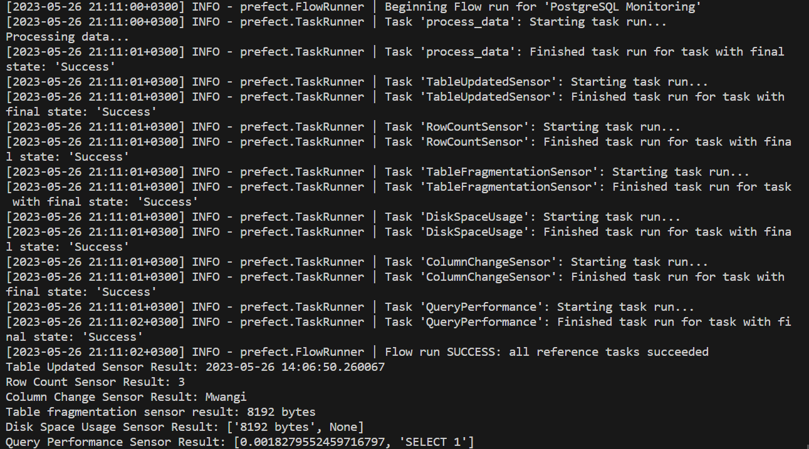

# Prefect PostgreSQL Sensors

[](https://badge.fury.io/py/prefect-postgres-sensors)
[](https://opensource.org/licenses/MIT)
[](https://travis-ci.com/James-Wachuka/Prefect-PostgreSQL-Sensors)
[](https://coveralls.io/github/James-Wachuka/Prefect-PostgreSQL-Sensors?branch=main)
[](https://pypi.org/project/prefect-postgres-sensors/)
[](https://github.com/James-Wachuka/prefect-postgres-sensors/stargazers)


The `prefect_postgres_sensors` package provides Prefect sensors for monitoring changes or conditions within a PostgreSQL database.

## Features

- **TableUpdatedSensor**: Monitors the last update timestamp of a table in a PostgreSQL database.
- **RowCountSensor**: Retrieves the row count of a table in a PostgreSQL database.
- **ColumnChangeSensor**: Detects changes in specific columns of a table in a PostgreSQL 
database.
- **QueryPerformance**: Monitors the performance of queries executed against the table.
- **TableFragmentationSensor**: Monitors the level of fragmentation within the table itself. 
- **DiskSpaceUsage**: Tracks the disk space used by the table and its associated indexes. 

## Installation

Install the package via pip:

```
pip install prefect_postgres_sensors
```

## Usage

Here's an example of how you can use the `prefect_postgres_sensors` package:

```
from prefect import Flow, task
from prefect_postgres_sensors.sensors.postgres_sensors_copy import TableUpdatedSensor, RowCountSensor, ColumnChangeSensor, TableFragmentationSensor, DiskSpaceUsage, QueryPerformance

# Define your PostgreSQL connection parameters
conn_params = {
    "host": "localhost",
    "port": 5432,
    "database": "kafka",
    "user": "data_eng",
    "password": "data_eng",
}

@task
def process_data():
    print("Processing data...")

# Create a Prefect flow
with Flow("PostgreSQL Monitoring") as flow:
    last_updated_row = TableUpdatedSensor(table_name="users", conn_params=conn_params, last_updated_column="last_updated")
    row_count = RowCountSensor(table_name="users", conn_params=conn_params)
    changed_column = ColumnChangeSensor(table_name="users", column_name="name", conn_params=conn_params)
    table_fragmentation = TableFragmentationSensor(table_name="users", conn_params=conn_params)
    disk_space = DiskSpaceUsage(table_name="users", column_name="name", conn_params=conn_params)
    query_perf = QueryPerformance(table_name="users", column_name="name", conn_params=conn_params)
    process_task = process_data()


    # Connect the sensors and tasks
    last_updated_row.set_upstream(process_task)
    row_count.set_upstream(process_task)
    changed_column.set_upstream(process_task)
    table_fragmentation.set_upstream(process_task)
    disk_space.set_upstream(process_task)
    query_perf.set_upstream(process_task) 
# Run the flow
flow_result = flow.run()

# Print returned values from different flow runs
print("Table Updated Sensor Result:", flow_result.result[last_updated_row].result)
print("Row Count Sensor Result:", flow_result.result[row_count].result)
print("Column Change Sensor Result:", flow_result.result[changed_column].result)
print("Table fragmentation sensor result:", flow_result.result[table_fragmentation].result)
print("Disk Space Usage Sensor Result:", flow_result.result[disk_space].result)
print("Query Performance Sensor Result:", flow_result.result[query_perf].result)

```

Make sure to replace the placeholder values (`table`, `last_updated`, `name`, etc.) with the actual table name, column name, you want to monitor in your PostgreSQL database.




## License

This project is licensed under the [MIT License](LICENSE).

## Contributing

Contributions are welcome!

## Acknowledgments

This package was inspired by the need to monitor PostgreSQL databases using Prefect.

## Support

For any questions or issues, please open an [issue](https://github.com/James-Wachuka/prefect-postgres-sensors/issues) on GitHub.

## Related Projects

- [Prefect](https://github.com/PrefectHQ/prefect): The core Prefect library for building, scheduling, and monitoring workflows.

## Release Notes

Please refer to the [Changelog](CHANGELOG.md) for release notes and version history.

